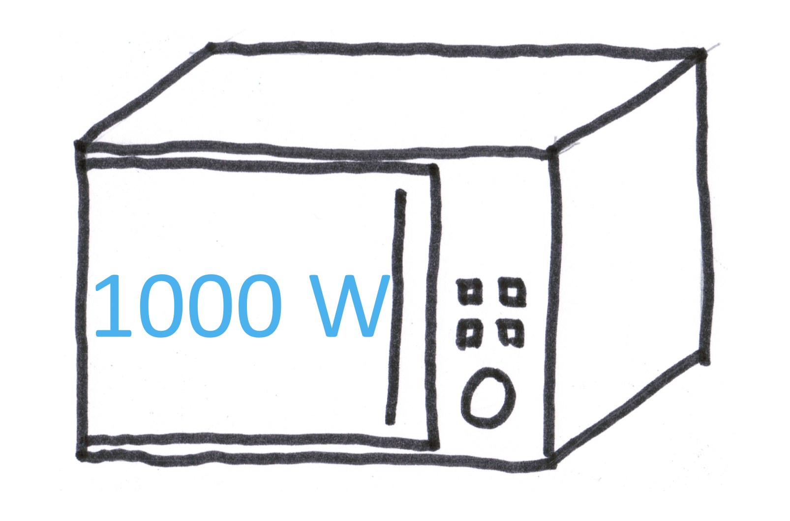
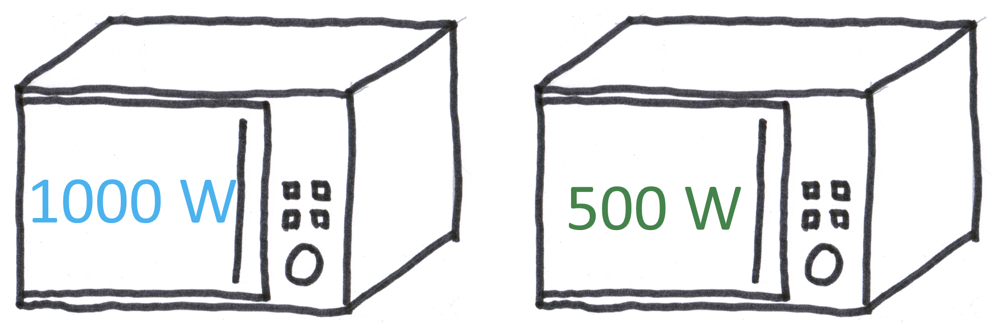
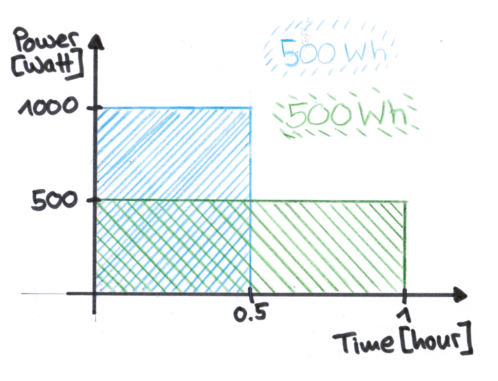

Energy, power, kilowatt-hour... These terms are not very intuitive to understand, to say the least. So, let's start with units: Let's say you have a microwave, which is labelled with 1000 Watts. 

These 1000 Watts are the **power** that the the microwave puts into your food to heat it up. If you run your microwave for one hour, it uses 1000 Watt-hours, or 1 kilowatt-hour of **energy** (\*). So energy is power summed up (mathematically: integrated) over time. If you were to plot the power used by the microwave over time, the energy would be the area under the curve. 

So kilowatt-hour is also the unit you see on your energy bill, as you pay for the power that you used over a certain time. 

Similarly, the data of the energy use in the Swiss cities comes in kilowatt-hours, with one value every 15 minutes. So the value we get represents the energy used over 15 minutes of time. 

But let's get back to your microwave to pinpoint the differences between energy and power a bit more. Let's say you have a microwave with maximal power of 1000 Watts, whereas mine only has a maximal power of 500 Watts. 

When you run your microwave for half an hour it uses 500 Watt-hours, which is the same as when I run my microwave for an hour. In both cases, the same amount of energy was spent to heat (or more likely burn) the food. 

However, the difference in power between our microwaves represent differences in how fast the energy can be spent (and therefore put into the food), so power in a way tells you how fast energy can be spent (to do some work such as heat your food).

For another approach, check out <a href="https://www.powernewz.ch/2020/kilo-giga-tera-watt/" target="_blank">this article</a> by the Elektizitätswerke Zürich (in German).

*(\*) kilo being one of the commonly used scaling factors: kilo means 1000 (10 to the power of 3), Mega means 1 million (10 to the power of 6), and Giga means 1 billion (10 to the power of 9) (beware of language differences between UK English, American English and German... it is safer to indicate the order of magnitude!)*
